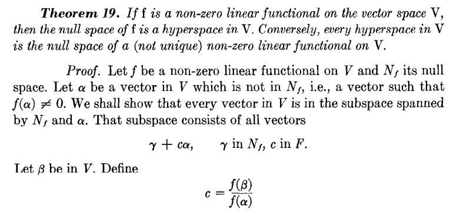
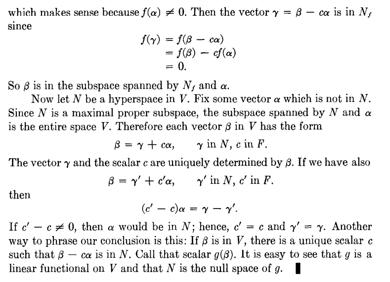

# 선형대수학

Linear Algebra - Hoffman and Kunze  
영어 단어들 정리하고 헷갈릴 수 있는 교재 theorem들 한국어로 증명한거 쓰려고 함  

중간중간 그냥 내 머리로 생각해서 적은 풀이도 있어서 틀릴 가능성 있음  
그냥 깃허브에서 보면 수식이 깨지고 html로 만드니까 인용문이 깨진다.  
jetbrains ide 기준 정상적으로 보이게 만들어짐.  

## Chapter1
- equivalent system : 같은 변수, 같은 해집합 시스템  
- row-equivalent : 행 동치(기본행연산으로 만들 수 있는 것)  
- row-reduced : 각 행에서 첫 번째 수는 1, 그 첫 수가 있는 열은 그 수 제외 모두 0  
- row-reduced echelon matrix : row reduced이고, 모두 0인 행은 맨 아래에 있고, 아래로 갈수록 0 아닌 원소 나오는 위치 뒤로 가는 형태(row reduced에서 행 정렬까지 한 행렬)  
- homogeneous system : Ax=0 꼴의 우변 0인 시스템으로 자명한 해 x=0 존재
- elementary matrix : identity matrix에서 기본행연산 1번으로 얻을 수 있는 행렬

 

모든 행렬은 row-equivalent인 row-reduced, row-reduced echelon matrix 존재한다. 
> 과정을 잘 설명만 하면 된다. 영어가 좀 어렵긴 하네.

 

열 방향이 더 긴 행렬 A가 있으면 Ax=0 homogeneous system에서 non-trivial solution이 존재한다. 
> row-reduced echelon matrix로 바꿀 수 있고 이것은 equivalent system이다.  
> 이때 1이 최초로 등장하는 열 번호를 제외한 나머지를 아무거나 하고 1이 나오는 열의 값만 맞추면 그것이 non-trivial solution이다. 

 

정사각행렬이 identity metrix와 row-equivalent인 것과 Ax=0이 trivial solution만 가지는 것은 동치이다. 
> identity metrix면 당연히 Ix=x=0 trivial solution  
> trivial solution만 가진다고 하면 Ax=0을 row-reduced echelon matrix로 바꿔서 Rx=0으로 만들 수 있을 것이다.  
> 그런데 Rx=0이 x=0만 가능하기 때문에 모두 0인 행이 존재한다고 하면 그 항을 제외하고 나머지로만 식을 만들 수 있고, 그렇게 되면 열 방향이 더 긴 행렬이 되어 non-trivial solution이 존재하여 모두 0인 행은 존재할 수 없다.  
> 모두 0인 행이 없으려면 1이 대각선으로 쭉 있어야 하고 row-reduced의 정의에 의해 1이 있는 열 나머지는 다 0이 되어 identity metrix가 된다. 

 

대충 행렬곱 결합법칙 정도는 알고 있겠지?

 

기본행연산 e에 대해 e(A)=e(I)A
> e(AB)=e(A)B임을 증명해도 된다.  
> 간단하게 설명하면 A의 변화한 행이랑 B가 곱해지는 것이고 그 결과의 행에만 영향을 준다.  
> 제대로 하려면 연산 하나하나 따로 증명하는 것밖에 없나?  

같은 원리로 기본열연산 e에 대해 e(AB)=Ae(B)

 

n*n 행렬 A에 대해 아래 3개는 동치이다.  
- A는 가역행렬이다. 
- A는 identity matrix와 row-equivalent이다. 
- A는 elementary matrices의 곱이다.
> A의 row-reduced echelon matrix를 R이라고 하면 기본행연산 $E_i$에 대해 $R=E_1E_2...E_nA$이다.  
> elementary matrix는 가역이기 때문에 $A=E^{-1}_nE^{-1}_{n-1}...E^{-1}_1R$  
> A가 가역이면 R은 가역행렬의 곱이 되어 가역이다.  
> R은 n*n 행렬이고 row-reduced echelon matrix이다. 그리고 가역이기 때문에 0인 행이 존재하지 않아서 R은 identity matrix이다.  
> 그러면 A는 identity matrix와 row-equivalent가 된다.  
> elementary matrix의 역행렬도 elementary matrix이기 때문에 A는 elementary matrices의 곱이다. 
> 가역행렬의 곱은 가역이다. 따라서 A가 가역인 것으로 돌아와 동치가 된다. 

 

n*n 행렬 A에 대해 아래 3개는 동치이다.  
- A는 가역행렬이다. 
- Ax=0은 trivial solution x=0만을 가진다. 
- Ax=y는 y 1개당 1개의 solution을 가진다. 
> A가 가역이면 Ax=y에서 $x=A^{-1}y$ 1개의 solution을 가진다.  
> Ax=y가 1개의 solution을 가지면 Ax=0에서도 x=0 1개만 가지게 된다.  
> Ax=0에서 x=0만 가능하다는 것은 A가 identity matrix와 row-equivalent라는 것이다.  
> 그러면 $A=E_1E_2...E_nI$꼴로 나타낼 수 있고 A는 가역행렬의 곱이 되어 가역으로 돌아와 동치가 된다. 

## Chapter 2
- commutative : 교환법칙 성립
- associative : 결합법칙 성립
- subspace-spanned : 어떤 벡터들을 포함하고 있는 벡터공간의 모든 부분공간의 교집합을 벡터의 subspace-spanned라고 한다.

 

W가 V의 subspace인 것과 V에서 정의한 연산 그대로 W에 적용하여 W에 포함된 a, b, 스칼라 c에 대해 ac+b가 W에 포함되는 것은 동치이다. 
> 분배, 결합 등은 V 벡터공간으로 증명됨  
> (-1)p+p=0으로 덧셈 항등원 포함, (-1)p+0=-p로 덧셈 역원 포함  
> ca+0=ca로 스칼라곱 닫힘, 1a+b=a+b로 덧셈 닫힘  

 

V의 subspace의 intersection은 subspace이다. 
> $W_1$, $W_2$라고 하고 intersection을 W라고 하자.  
> $W_1$, $W_2$는 부분공간이므로 W에 포함되는 a, b에 대해 ca+b는 $W_1$, $W_2$에 둘다 포함되게 된다. 
> 이것이 W와 같고 W도 부분공간이 된다. 

 

subspace-spanned인 subspace는 벡터들의 선형결합으로 이루어진 집합이다. 
> 일단 벡터공간이니 당연히 선형결합은 존재한다.  
> 선형결합이 아닌 것이 있으면 당연히 그것을 포함하지 않는 것이 존재하여 교집합 안에 포함되지 않음. 

 

$a_1, a_2, ..., a_m$ 벡터의 생성공간에서 어떤 선형독립 집합도 m개보다 많은 원소를 가질 수 없다. 
> m보다 많은 선형독립 벡터 집합 $S=\{b_1, b_2, ..., b_n\}$ $(n>m)$ 존재하면  
> b들은 a의 선형결합이므로 행렬 A가 존재하여 아래의 식이 성립한다. 
> $$
\begin{bmatrix} b_1 & b_2 & ... & b_n \end{bmatrix} = \begin{bmatrix} a_1 & a_2 & ... & a_m \end{bmatrix}A
$$
> 이때 $bx=aAx=0$ 이므로 $Ax=0$ 인 x가 0 말고 존재한다면 S는 선형독립이 아니게 된다.  
> 한쪽이 더 긴 행렬은 non-trivial 해가 존재한다는 것을 위에 간단하게 증명해두었다.  

 

Lenma : 어떤 집합의 생성공간에 포함되지 않는 벡터는 그 집합과 선형독립이다.  
증명은 선형독립이 아니라고 하면 그냥 그 생성공간에 포함이 된다. 

W가 유한 차원 벡터공간 V의 부분공간이면 W의 모든 선형독립 부분집합은 유한하고 기저의 일부가 될 수 있다. 
> V가 유한 차원이기 때문에 W도 부분집합이라 유한 차원이다. 따라서 W의 유한한 차원보다 많은 선형독립 집합은 존재하지 않는다.  
> 어떤 선형독립 집합을 S라고 하고 span(S)!=W이면 W-span(S)의 임의의 원소 b를 하나 가져오면 S와 선형독립이다.  
> S.add(b) 하면서 span(S)==W 될 때까지 반복

 

유한차원 벡터공간에서 $dim(W_1)+dim(W_2)=dim(W_1∪W_2)+dim(W_1∩W_2)$
> $W_1∩W_2$의 기저를 위의 Theorem을 이용해서 확장하면 된다.

 

$[\alpha]_{\beta}$ : 벡터 $\alpha$를 ordered basis $\beta$로 만드는 좌표를 의미함 (coordinate)  
좌표변환 행렬 P : $[\alpha]_{\beta}=P[\alpha]_{\beta^{'}}$  
P는 invertible이고 유일하다. 
$$
α=\begin{bmatrix}β_1 & β_2 & ... & β_n\end{bmatrix}[α]_{β}
$$
$$
=\begin{bmatrix}β_1 & β_2 & ... & β_n\end{bmatrix}P[α]_{β^{'}}
$$
$$
=\begin{bmatrix}β_1^{'} & β_2^{'} & ... & β_n^{'}\end{bmatrix}[α]_{β^{'}}
$$
$$
βP=β^{'}
$$
P의 col vector는 $β^{'}$의 각 기저를 $β$로 나타낸 좌표 벡터이다. 

 

row-reduced echelon matrix의 0이 아닌 row vector들은 그것의 row space의 기저이다. 
> row vector의 생성공간이기 때문에 선형독립만 증명하면 된다.  
> 선형독립도 그냥 선형결합으로 0을 만든다고 했을 때 1이 최초로 등장하는 부분에는 나머지가 0이므로 그 0이 곱해져야 그 열이 0이 된다.  

 

$F^n$의 부분공간인 W가 존재할 때 row space가 W가 되는 0이 아닌 row-reduced echelon matrix가 유일하게 존재한다. 
> 선형독립인 임의의 기저 하나를 그냥 잡을 수 있다. (기저로 확장 가능하기 때문)   
> 이걸 row-reduced echelon matrix로 바꾸면 최소 하나는 존재하게 된다.  
> row space가 같은 2개의 row-reduced echelon matrix가 존재한다고 하면 이 2개는 row-equivalent이다.
> row-equivalent인 row-reduced echelon matrix 2개는 없다.  
> https://www.youtube.com/watch?v=EcgaeUUYV1U  

근데 이거 뭔가 이상하다. 교과서에서는 row-reduced echelon matrix의 유일성 없이 증명하고 이걸 통해서 유일성을 증명했다. 나중에 확인해보고 바꿔야 할지도

 

## Chapter 3
- linear operator : V to V 선형변환
- 선형변환에서 invertible : T가 있을 때 UT=TU=I인 선형변환 U가 존재하면 U=T$^{-1}$이고 T는 invertible이다.
- non-singular : T(x)=0인 x가 0 하나밖에 없으면 T를 non-singular이라고 한다.  
- Group(군) : 어떤 원소들의 집합인데 2개 원소의 연산을 정의하여 그 연산의 결합법칙 성립, 항등원 존재, 역원 존재하는 것  
- isomorphism : 벡터공간 V, W에 대해 V to W 선형변환 T가 일대일대응일 때 T를 isomorphism of V onto W라고 한다. isomorphism of V onto W가 존재하면 V는 isomorphic to W이다.  
- similarity : n*n 행렬 A, B에 대해 $B=P^{-1}AP$인 가역행렬 P가 존재하면 similar이라고 한다.  
- dual space : 벡터공간에서 스칼라 공간으로 가는 선형변환의 공간  
- hyperspace : 1차원 낮은 부분공간  
- annihilator : V의 dual space의 부분공간인데 V의 부분공간인 W의 원소들을 모두 0으로 만드는 함수의 집합을 W의 annihilator라고 한다. W$^0$으로 표기한다.  
- double dual : dual space의 dual space이다. 슬슬 타입이 엄청나게 복잡해진다. W$^{00}$으로 표기한다.  

T가 V to W 선형변환일 때 rank(T)+nullity(T)=dim(V)
> T의 nullspace의 기저를 쭉 나타내고 그것을 $b_1, b_2, ..., b_n$이라고 하자.  
> 여기에서 dim(V)=m개까지 기저 확장이 가능하다.  
> 그러면 $b_{n+1}, b_{n+1}, ..., b_m$이 추가로 들어가게 되고 $T(b_{n+1}), ..., T(b_{m})$이 T(V)를 생성함을 보이면 된다. 
> 일단 $b_1, b_2, ..., b_m$은 V의 기저이다. $T(b_1), ..., T(b_m)$은 T(V)를 생성한다.  
> 근데 $b_1, b_2, ..., b_n$은 T 거치면 0이 되니까 당연히 $T(b_{n+1}), ..., T(b_{m})$로도 T(V)를 생성한다.  

 

A가 m*n 행렬일 때 row rank(A)=column rank(A)
> n차원 벡터 x T(x)=Ax일때 rank(T)=column rank(A)=n-nullity(T)  
> Ax=0을 만드는 x의 차원을 생각해보면 A를 row-reduced echelon matrix로 바꿔서  
> Rx=0으로 생각할 수 있고 R의 0이 아닌 행의 수를 r이라고 할 때 r은 column rank(A)가 된다.  
> $x_1, x_2, ..., x_n$ 중에서 첫 1이 나오는 자리에 들어가는 x들을 제외하고 모두 자유롭게 결정할 수 있다.  
> 1이 나오는 자리의 수는 r이라서 Rx=0이 되는 x의 차원은 n-r=n-column rank(A)이다.  

 

각각 m, n차원 벡터공간 W, V에 대해 L(W, V)는 mn차원 벡터공간이다. (L(W, V)는 W to V 선형변환의 집합을 의미함)
> W의 기저 $a_1, a_2, ..., a_m$  
> V의 기저 $b_1, b_2, ..., b_n$  
> $T_{ij}(a_i)=b_j$ 이것으로 모든 선형변환 T를 유일하게 만들 수 있다는 것을 증명해야 한다.  
> 임의의 T에 대해 $[T(a_1)]_b, [T(a_1)]_b, ..., [T(a_m)]_b$를 얻으면 mn개의 $T_{ij}(a_i)=b_j$와 일대일로 대응된다.  
> $[T(x)]_b=\begin{bmatrix}[T(a_1)]_b && [T(a_1)]_b && ... && [T(a_m)]_b\end{bmatrix}[x]_a$로 모든 x에 대해 T값을 알 수 있다.   
> 따라서 $T_{ij}$가 있으면 모든 x에 대해 T(x)가 정해지게 된다. 모든 선형변환을 만들 수 있음이 증명되었다.  

 

모든 V에서 선형독립인 집합이 T를 거쳐서 W에서 선형독립 집합이 되는 것과 T가 non-singular인 것은 동치이다.  
> V의 선형독립 집합인 기저 a={$β_1, β_2, ..., β_n$}이 있을 때 b={$T(β_1), T(β_2), ..., T(β_n)$}가 W에서 선형독립이라면  
> $T(x)=T([β_1\ \ β_2\ \ ...\ \ β_n][x]_a)=[T(β_1)\ \ T(β_2)\ \ ...\ \ T(β_n)][x]_a=0$  
> b가 선형독립 집합이라서 $[x]_a$가 0밖에 없다.  
>   
> 만약 T(x)=x가 0밖에 없으면  
> 어떤 선형독립 집합 a={$β_1, β_2, ..., β_n$}를 V에서 잡아도 
> $c_1T(β_1)+c_2T(β_2)+...+c_nT(β_n)=T(c_1β_1+c_2β_2+...+c_nβ_n)=0$  
> $c_1β_1+c_2β_2+...+c_nβ_n=0$밖에 없는데 a가 선형독립 집합이라서 $c_i=0$밖에 없고 $T(β_i)$들도 선형독립이다.  

 

차원이 같은 두 집합 V, W에서 V to W 선형변환 T에 대해 아래 3개는 동치이다.  
T는 invertible이다.  
T는 non-singular이다.  
T는 onto이다. (T(V)=W)
> T가 invertible이면 $T(x)=0$의 해는 $x=T^{-1}(0)=0$ 하나뿐이다. (non-singular)  
> T(x)=0이면 x=0이라는 것은 T의 nullspace가 0 하나라는 것이고 nullity(T)=0, rank(T)=dim(V)이다.  
> T(V)가 W의 부분공간이고 차원이 같다. 따라서 T(V)=W가 된다. (뭔가 증명이 필요할 것 같은데 일단 교과서에는 이렇게 나옴)  
> 그리고 서로 다른 x, y에 대해 T(x)=T(y)라고 하면 T(x-y)=0인 것이 x-y=0밖에 없어서 injective이다.  
> T는 일대일대응이고 invertible이다.  
> 교과서에는 뭔가 이상하게 해놨다. 이 풀이가 맞는 것 같은데 기저가 어쩌고 저쩌고 하고 non-singular에서 invertible을 그냥 넘어간다.  

 

F 위에서 정의된 n차원 벡터공간은 isomorphic to F$^n$이다.  
> 벡터공간의 순서 기저를 적당히 하나 잡고 그 좌표와 대응되는 선형변환이 존재한다.  

 

n차원 벡터공간 V, m차원 벡터공간 W, V의 순서 기저 $β$, W의 순서 기저 $β^{'}$  
V to W 선형변환에 대해 $[T(x)]_{β^{'}}=A[x]_β$ 인 행렬 A가 존재한다.  
> 증명보다는 그냥 많이 사용하는 정리일듯  
> A를 matrix of T relative to the ordered basis라고 부른다.  

 

n차원 벡터공간 V, m차원 벡터공간 W, V의 순서 기저 $β$, W의 순서 기저 $β^{'}$  
V to W 선형변환 T와 matrix of T relative to the ordered basis는 isomorphism이다. (T랑 A는 ismorphism이다.)  
> 이것도 증명보다는 많이 사용하는 정리일 것 같다.  

 

벡터공간 V의 순서기저 $β$, $β^{'}$  
T가 V에서의 linear operator일 때 좌표변환 행렬 $P=\begin{bmatrix}[α_1^{'}]_β & [α_1^{'}]_β & ... & [α_n^{'}]_β\end{bmatrix}$  
$[T]_{β^{'}}=P^{-1}[T]_{β}P$이다.  
> 예를 들어 설명하자면 
> $$
β=\{\begin{bmatrix}1 \\ 0 \\ 0\end{bmatrix}, \begin{bmatrix}0 \\ 1 \\ 0\end{bmatrix}, \begin{bmatrix}0 \\ 0 \\ 1\end{bmatrix}\}, \ \ 
β^{'}=\{\begin{bmatrix}1 \\ 0 \\ 1\end{bmatrix}, \begin{bmatrix}1 \\ 1 \\ 0\end{bmatrix}, \begin{bmatrix}0 \\ 1 \\ 1\end{bmatrix}\}
$$
$$
T(x_1, x_2, x_3)=(2x_1+x_3, x_2+x_1, 2x_2+x_3)
$$
$$
[T]_β=\begin{bmatrix} 2 & 0 & 1 \\ 1 & 1 & 0 \\ 0 & 2 & 1 \end{bmatrix},\ \ 
P=\begin{bmatrix}1&1&0 \\ 0&1&1 \\ 1&0&1\end{bmatrix}
$$
> 이런 상황에서 $[T]_β$, $P$를 구하기는 쉬운데 바로 $[T]_{β^{'}}$를 구하기는 어렵다. 
> $$
T(x)=β^{'}[T]_{β^{'}}[x]_{β^{'}}=β[T]_{β}[x]_{β}
$$
> $β$, $β^{'}$ 에서의 좌표 $c$, $c^{'}$에 대해 
$$
βc=β^{'}c^{'}=β^{'}P^{-1}c,\ \ [x]_{β}=P[x]_{β^{'}}
$$
$$
T(x)=β^{'}[T]_{β^{'}}[x]_{β^{'}}=β[T]_{β}[x]_{β}=β[T]_{β}P[x]_{β^{'}}=β^{'}P^{-1}[T]_{β}P[x]_{β^{'}}
$$
$$
[T]_{β^{'}}=P^{-1}[T]_{β}P
$$
> 좌표변환 행렬 외에도 invertible operator이면 된다.  

 

기저 $β=\{α_1, α_2, .., α_n\}$인 V에 대해 V의 dual space에 대해 dual basis를 정의할 수 있다.  
dual basis는 $\{f_1, f_2, ..., f_n\ |\ f_i(a_j)=(1\ \ if\ \ i==j\ \ else\ \ 0)\}$ 이것을 만족하는 유일한 f들로 정의된다.  

이걸 다항식에 적용하면 실수 위에서 정의된 2차 이하 다항식의 dual space는 다항식을 넣으면 그 스칼라 값으로 나오는 함수의 집합이라고 할 수 있다.   
여기에서 다항식 집합의 순서기저를 잘 잡으면 그 함수를 그냥 다항식에 값 대입으로 바꿀 수 있는데 그걸 만족하는 것이 라그랑주 다항식이다.  

 

벡터공간 V의 부분공간 W에 대해 dim(W)+dim(W$^0$)=dim(V)
> W의 기저 $\{α_1, α_2, ..., α_k\}$이면 V의 부분공간이라 기저로 확장하여 $\{α_1, α_2, ..., α_k, α_{k+1}, ..., α_n\}$까지 만들 수 있다.  
> 이 기저가 있을 때 V의 dual basis를 생각해보면 $f_{k+1}$~$f_n$의 생성공간이 $W^0$이 된다.
> 당연히 저 생성공간은 $W^0$의 부분집합이고, 만약 생성공간에 포함되지 않고 $W^0$에 포함되는 것이 있다면 그것을 $f^{'}$로 하여  
> $f^{'}(α_1)=f^{'}(α_2)=...=f^{'}(α_k)=0$인데 
> $$
f^{'}=\sum_{i=k+1}^n f^{'}(α_i)f_i=0
$$따라서 span 안에 포함되어 모순이다.  
> $$
dim(V)=n, dim(W)=k, dim(W^0)=n-k  
$$
$$
dim(W)+dim(W^0)=dim(V)
$$

 

$f$가 $F$ 위에서 정의된 벡터공간 $V$의 dual space의 원소일 때 $L_α(f)=f(a)$로 정의하면  
$α$ to $L_α(f)$는 isomorphism of $V$ into $V^{**}$
> 일단 선형변환이기는 하고  
> $L_{α_1}(f)-L_{α_2}(f)=f(α_1)-f(α_2)=f(α_1-α_2)=0$이면  
> $V$의 dual basis를 $f$에 넣을 수 있어서 어떤 기저든 $f(α_1-α_2)=0$에서 $α_1-α_2$의 좌표는 0일 수밖에 없다.  
> 일대일대응도 성립하여 isomorphism

$dim(V)=dim(V^*)=dim(V^{**})=...$인 것도 알 수 있다.  

 

S가 유한차원 벡터공간 V의 부분집합일 때 S$^{00}$은 span(S)의 부분공간이다? 왜지?  
$α$ to $L_α(f)$는 isomorphism of $V$ into $V^{**}$ 이거 때문에 $V$, $V^{**}$를 동일하게 본다고 한다.  

 

V의 dual space의 0이 아닌 원소 f가 있으면 $N_f$는 V의 hyperspace이고  
어떤 집합이 hyperspace이면 f가 존재하여 $N_f$와 같아진다.  
> 당연히 dual space의 rank가 1이라서 hyperspace이고  
> hyperspace를 S라고 하면 S의 기저와 S에 포함되지 않는 거 하나 가지고 그거 빼고 다 0인 선형 함수 만들면 되는데  
> 왜 이런 짓을 한거지?
>   
> 

 

g가 dual space의 원소 $f_1, f_2, ..., f_n$의 선형결합인 것과 $N_g⊇N_{f_1}∩N_{f_2}∩...∩N_{f_n}$는 동치이다.  
> 선형결합이라면 당연히 g값을 0으로 만드는 공간에는 모든 $f_i$값을 0으로 만드는 것이 포함될 것이다.  
> $N_{g_n}⊇N_{f_1}∩N_{f_2}∩...∩N_{f_n}$일 때 $g_n$이 $f_1, f_2, ..., f_n$의 선형결합이라면  
> $N_{g_{n+1}}⊇N_{f_1}∩N_{f_2}∩...∩N_{f_{n+1}}$일 때 $g_{n+1}=g_n+h$로 정의하여 $N_{f_{n+1}}$의 원소가 포함되니까  
> $f_{n+1}(x)=0$이면 $g_{n+1}(x)=g_n(x)+0=g_n(x)+h(x)=0$이라서 h의 nullspace는 $N_{f_{n+1}}$을 포함하게 되고 다른 원소가 있으면 차원이 늘어나서 hyperspace가 아니게 되어 h의 nullspace는 $N_{f_{n+1}}$이다.  
> 이때 $h=cf_{n+1}$이다. (nullspace의 원소를 넣으면 그냥 0이 되서 성립하고, nullspace에 없는 원소 $α$를 넣었다고 하면 c값이 정해지고 nullspace에 포함되는$β$, 스칼라 $a$에 대해 $aα+β$를 대입했을 때도 당연히 성립한다.)

 

V to W 선형변환 T에 대해 다음을 만족하는 $W^*$ to $V^*$ 함수를 T의 transpose라고 하고 $T^t$로 표기한다.  
$(T^tg)(α)=g(Tα)$ 이런 $T^t$는 유일하게 존재한다.  
rank(T)=rank(T$^t$)이고 ker(T$^t$)=(im(T))$^0$
> 일단 T를 벡터공간 V에서 W로 가는 선형변환으로 가정하면  
> T$^t$는 W$^*$에서 V$^*$로 가는 선형변환이고 T의 transpose이다.  
> 임의의 W$^*$의 원소 g에 대해 $(T^t(g))(α)=g(Tα)$가 성립한다.  
> 이것의 ker은 $W^*$의 원소이고 모든 α에 대해 $(T^t(x))(α)=0$이 되는 W에서 스칼라로 가는 함수 x들의 집합이다. (W$^*$의 부분집합)  
> 그리고 im(T)는 W에서 T의 이미지를 의미한다. 그리고 이것의 annihilator는 T의 결과들을 0으로 만드는 함수들의 집합(W$^*$의 부분집합)을 의미한다. 모든 α에 대해 x(T(α))=0인 x들의 집합이다.  
> 근데 $(T^t(x))(α)=x(T(α))$라서 $(T^t(x))(α)=0$ 해집합이랑 $x(T(α))=0$ 해집합은 당연히 같을 수밖에 없다.  
> 
> ker(T$^t$)=(im(T))$^0$를 이용하면 dim(ker(T$^t$))=dim(im(T)$^0$)=dim(W)-rank(T)  
> 어렵다
> 
> 무슨 타입이 이렇게 복잡해...  
> 엄청나게 꼬아놓은 함수형 프로그래밍 보는 것 같네.  

 

T가 V to W 선형변환이고 V의 ordered basis $β$, W의 ordered basis $β^{'}$, 각각의 dual basis $β^*$, $β^{'*}$  
A가 matrix of $T$ related to $β$, $β^{'}$이고  
B가 matrix of $T^t$ related to $β^{'*}$, $β^*$이다.  
이때 B가 A의 전치행렬이다.  
> $$
(T^t(g))(α)=(β^*B[g]_{β^{'*}})(α)=B[g]_{β^{'*}} · [α]_β
$$
> $$
g(T(α))=g(β^{'}A[α]_β)=β^{'*}[g]_{β^{'*}}(β^{'}A[α]_β)=[g]_{β^{'*}} · A[α]_β
$$
> $$
B[g]_{β^{'*}} · [α]_β=(B[g]_{β^{'*}})^T[α]_β=([g]_{β^{'*}})^TB^T[α]_β
$$
> $$
[g]_{β^{'*}} · A[α]_β=([g]_{β^{'*}})^TA[α]_β
$$
> $$
([g]_{β^{'*}})^TB^T[α]_β=([g]_{β^{'*}})^TA[α]_β
$$
> $$
A=B^T
$$

T가 V to W 선형변환  
T$^t$가 W$^*$ to V$^*$ 선형변환  
근데 T의 image가 0이 된다는 것은 T를 함수에 한번 합성시키면 0이 되는 함수를 의미한다.  

 

## Chapter 4

- ring(환) : 덧셈에서 닫혀있고 곱셈에 의해 닫혀있는 집합에서 아래 3개 만족하면 된다.  
  덧셈 교환법칙 성립  
  곱셈 결합법칙 성립  
  분배법칙 성립  
  여기에서 곱셈 항등원 존재하고 곱셈 교환법칙 성립하면 ring with identity라고 한다.  
- Linear Algebra over field F : F 위의 벡터공간 A가 벡터간 덧셈 외에도 벡터간 곱셈이 추가로 정의되어 결합법칙, 분배법칙, 스칼라곱 호환 성립하면 선형대수라고 한다.
  대표적으로 다항식은 Linear Algebra이다. 
- Polynomial over F ($F[x]$) : F에서 정의된 무한차원 벡터공간이고 1, $x$, $x^2$, ... 의 생성공간
- deg(f) : f가 polynomial일 때 차수를 의미한다. Thm1에서 non-0 polynomial 조건 있어서 gpt한테 물어보니까 0의 차수는 -inf라고 한다. 
- scala polynomials : 상수항만 있는거
- Vandermonde matrix : $\begin{bmatrix}
1 & x_0 & x_0^2 & \cdots & x_0^n \\
1 & x_1 & x_1^2 & \cdots & x_1^n \\
\vdots & \vdots & \vdots & \ddots & \vdots \\
1 & x_n & x_n^2 & \cdots & x_n^n \\
\end{bmatrix}$
- 두 Linear Algebra의 isomorphic : 어떤 bijective 선형 사상이 존재하여 $T(cα+dβ)=cT(α)+dT(β)$, $T(αβ)=T(α)T(β)$
- 추가로 궁금해서 찾아봤는데 일대일대응 선형 함수가 존재하는 Linear Algebra, Vector Space가 있을 때 구조 이식으로 Vector Space를 Linear Algebra로 승격 가능
- 어떤 다항식 f가 있을 때 f를 0으로 만드는 값을 root, 또는 zero of a given polynomial over F라고 한다. 
- multiplicity : 중근  
  어떤 자연수 r에 대해 0번째부터 r번째 미분값까지는 0이고 이후에 r+1번째에서 0이 아닌 경우 중근이라고 한다. 
- ideal in $\mathbb{F}[x]$ : $\mathbb{F}[x]$의 부분공간인데 $\text{If } f \in \mathbb{F}[x],\ g \in M \Rightarrow fg \in M$ 이면 M을 ideal in $\mathbb{F}[x]$이라고 한다.  
  보편적인 ideal의 정의는 commutative ring(곱셈 교환법칙 성립하는 환)에서 곱셈 흡수 조건과 함께 덧셈에 대해 닫혀있고 덧셈 항등원과 역원이 존재한다는 조건이 더 들어간다.  
  다항식의 경우 그런 거 없어도 -1, 0이 다항식 안에 있어서 되는데 아니 잠깐 생각해보니 일반적인 환도 마찬가지 아님?  
- $(x+1)\mathbb{F}[x]$ 이런 식으로 (x+1)의 배수인 ideal을 쓴다. 
- monic polynomial : 최고차항 1인 다항식
- irreducible polynomial : 인수분해 안되는 다항식
- relatively prime : 서로소

영어가 너무 많다.  

라그랑주 보간법
$$
\begin{bmatrix}
1 & x_0 & x_0^2 & \cdots & x_0^n \\
1 & x_1 & x_1^2 & \cdots & x_1^n \\
\vdots & \vdots & \vdots & \ddots & \vdots \\
1 & x_n & x_n^2 & \cdots & x_n^n \\
\end{bmatrix}
\cdot
\begin{bmatrix}
a_0 \\
a_1 \\
\vdots \\
a_n \\
\end{bmatrix}
=
\begin{bmatrix}
y_0 \\
y_1 \\
\vdots \\
y_n \\
\end{bmatrix}
$$

Vandermonde matrix가 invertible이라서 간단하게 행렬 연산으로 구할 수도 있다. 

$\mathbb{F}[x]$의 ideal은 최소 단위가 존재하여 그 단위의 다항식 배수가 된다.  
> d가 최소 차수 다항식이라고 하자.  
> ideal이 subspace라서 덧셈에 닫혀있기 때문에 ideal 안의 임의의 다항식 f라고 한다면  
> f=dp+r 형식으로 나올 것이고 r도 그 ideal에 포함되게 된다. 근데 r은 d보다 작은 차수라서 0밖에 없다.  
> 따라서 임의의 f가 d의 다항식 배수가 된다.  
> 이걸 $d\mathbb{F}[x]$로 표현한다.  

다항식들의 최대공약수를 정의할 수 있다.  
> $\sum p_i\mathbb{F}[x]=d\mathbb{F}[x]$인 d가 $p_i$의 최대공약수이다.

 
 
 
 
 
 
 
 
 
 
 
 
 
 
 
 
 
 
 
 
 
 
 
 
 
 
 
 
 
 
 
 
 
 
 
 
 
 
 
 
 
 
 
 
 
 
 

종강 언제하지